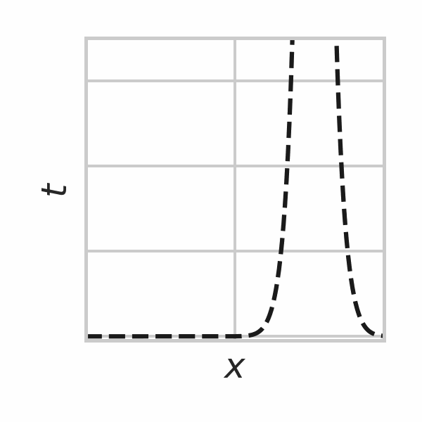

**🚧 Note 🚧 :** This repo is still under construction.

# Greedy Poisson Rejection Sampling

This repository contains experimental data and reference implementations of the relative entropy coding algorithms that were used in the paper

[Greedy Poisson Rejection Sampling](https://arxiv.org/abs/2305.15313)

by Gergely Flamich.



# Introduction

The paper proposes the Greedy Poisson Rejection Sampler (GPRS), a rejection sampling algorithm based on Poisson Processes.
The main goal of GPRS is to be utilized in a channel simulation protocol for encoding random samples from a target distribution using as few bits as necessary. 
Concretely, given a target distribution $Q$ and a proposal / coding distribution $P$, GPRS encodes a **single** random sample $x \sim Q$ using 
```math
  D_{KL}[Q\,\Vert\,P] + \log_2 (D_{KL}[Q\,\Vert\,P] + 1) + \mathcal{O}(1) 
```
bits, where $`D_{KL}[Q\,\Vert\,P]`$ denotes the Kullback-Leibler divergence of $Q$ from $P$ measured in bits.

Interestingly, GPRS provides a "rejection sampling" dual of [A* coding](https://arxiv.org/abs/2201.12857) / [A* sampling](https://arxiv.org/abs/1411.0030) / [the Poisson Functional Representation](https://arxiv.org/abs/1701.02827).
For a related algorithm, see [the Adaptive Greedy Rejection Sampler](https://arxiv.org/abs/2304.10407) / [Greedy Rejection Coding](https://arxiv.org/abs/2309.15746).

The paper proposes three variants of GPRS:
 - **Global GPRS:** The most general variant, as it is applicable to distributions $Q$ and $P$ over arbitrary Polish spaces, whenever the target distribution $Q$ is abosolutely continuous with respect to the coding distribution $P$.
 The minimum requirements for implementation are:
   - We can simulate $P$-distributed samples.
   - We can evaluate the density ratio (Radon-Nikodym derivative) $r = dQ/dP$.
   - We can evaluate the complementary CDFs $`w_P(h) = \mathbb{P}_{Z \sim P}[r(Z) \geq h]`$ and $`w_Q(h) = \mathbb{P}_{Z \sim Q}[r(Z) \geq h]`$.
   
   The number of steps $N$ this variant of GPRS takes on average is
   $` 
   \mathbb{E}[N] = \Vert dQ/dP \Vert_\infty = 2^{D_\infty[Q \, \Vert \, P]}, 
   `$
   where $\Vert \cdot \Vert_\infty$ denotes the ($P$-essential) infinity norm and $D_\infty[Q \, \Vert \, P]$ denotes the Renyi $\infty$-divergence of $Q$ from $P$ in bits. 

   Pseudo-code for global GPRS is given in Algorithm 3 in the paper.
 - **Parallelized GPRS:** This variant has the same mathematical requirements as global GPRS.
 However, if we have $J$ available parallel threads, we can utilize them to speed up GPRS by a factor of $J$.

   Pseudo-code for parallelized GPRS is given in Algorithm 4 in the paper.

 - **Branch-and-bound GPRS:** This variant can be far more efficient when the underlying space has more structure.
 There are two notable sub-variants:
   - **Split-on-sample GPRS:** 
     In addition to the requirements of global GPRS, this variant requires that:
       - the sample space is 1-dimensional
       - the density ratio $dQ/dP$ is unimodal.
       - we can simulate samples from the proposal $P$ truncated to arbitrary intervals $`(a, b)`$.

      The expected number of step $D$ this variant of GPRS takes on average before termination is $` \mathbb{E}[D] = \mathcal{O}(D_{KL}[Q \, \Vert \, P]) `$, which is **optimal**.

     Pseudo-code for this variant is given in Algorithm 5 in the paper.
   - **General branch-and-bound GPRS:**
   In addition to the requirements of global GPRS, this variant requires that:
     - There is a splitting function that takes a subset $B$ of the sample space, and returns a two-set partition of it, i.e. $` \mathrm{split}(B) = (L, R) `$ where $`L \cap R = \emptyset`$ and $`L \cup R = B`$.
     - We can compute $`w_P(h)`$ and $`w_Q(h)`$ truncated to some subset $B$ of the sample space
     - We can simulate a sample from the proposal $P$ restricted to some subset $B$ of the sample space.
     
     See the discussion in Appendix F of the paper for precise details.

     Pseudo-code for this variant is given in Algorithm 6 in the paper.

The repository provides JAX implementation of all of the above mentioned variants.

Please cit the paper if you find it useful in your research:

```bibtex
@inproceedings{flamich2023gprs,
  title = {Greedy Poisson Rejection Sampling},
  author = {Flamich, Gergely},
  booktitle = {Advances in Neural Information Processing Systems},
  year = {2023},
}
```

# Requirements
We provide our code as a Python 3 package written in [JAX](https://jax.readthedocs.io/en/latest/), alongside with some Jupyter notebooks.

To run the code, first clone the repo and install the package:
```bash
pip install --upgrade pip
pip install -e .
``` 

# Structure and Contents of the Repository

## Data

The data used to create the plots in Figures 1 and 2 can be found at:

```
.
+-- data
   +-- figure1
   |   +-- points.csv
   |   +-- stretched_density_ratio.csv
   +-- figure2
       +-- global_gprs_and_a_star.csv
       +-- gprs_and_a_star.csv
       +-- gprs_and_a_star_runtime_vs_inf_div.csv
```

